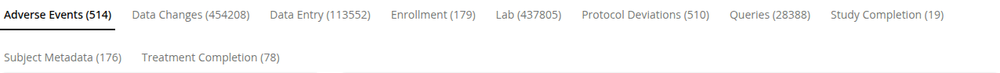
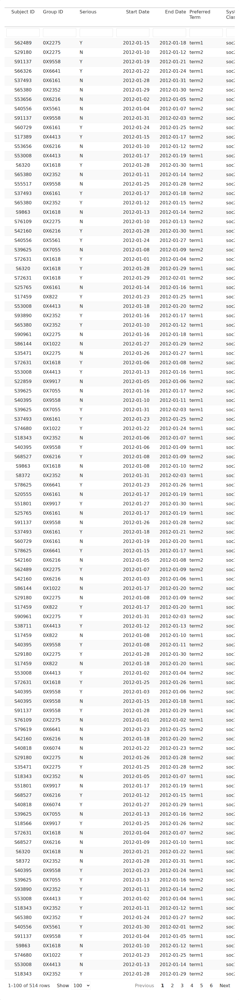

# 519: Users can easily explore Domain Details

## Description

[GitHub issue](https://github.com/Gilead-BioStats/gsm.app/issues/519)

Make it easier for users to explore the raw domain data presented on the
Domain Details tab.

------------------------------------------------------------------------

## Features & Bug Fixes

Explore the screenshot evidence presented here to determine if you agree
that the app does what is described. Click images for larger versions.
If you agree that the app does what is described, go to the linked
GitHub issue for that feature or bug fix, and comment with your
approval. If you do *not* agree, go to the linked GitHub issue for that
feature or bug fix, and comment with what you believe is incorrect.

543: Feature: The user can view counts of records for each available
data domain.

[GitHub issue](https://github.com/Gilead-BioStats/gsm.app/issues/543)

Domain row counts appear in parentheses after the title of each domain
in the Domain Details tab’s tabbed view of tables.

tabs have counts

The domain row counts update based on the selected “Group” and
“Participant” filters.

filter by group

filter by participant

unfiltered

The Domain Summary panel no longer appears on the Domain Details tab.

no domain summary card

385: Feature: The user can filter domain data.

[GitHub issue](https://github.com/Gilead-BioStats/gsm.app/issues/385)

Each column in the domain data tables has a field where users can type.

columns have filters

Data in the table is subset to include whatever is typed.

toxicity grade 3

unfiltered

496: Feature: The user can visualize domain categorical variable counts
by value.

[GitHub issue](https://github.com/Gilead-BioStats/gsm.app/issues/496)

The ‘Domain Details’ tab includes a ‘Prevalence’ card for each domain.

AE plot exists

ENROLL plot exists

The user can select a column to display in the ‘Prevalence’ card (out of
all categorical-like fields other than group level, group id, and
subject id), defaulting to the first valid column.

AE prevalence choices

The ‘Prevalence’ card displays a color-coded key for Study.

Study key exists

The ‘Prevalence’ card displays a bar plot of ‘% of rows’ vs the values
of the selected column, colored to indicate that it is at the Study
level.

prevalence plot study bars

The ‘Prevalence’ card displays a label with the numeric % of each value,
colored to indicate that it is at the Study level.

prevalence plot study label

When a group is selected, the ‘Prevalence’ card displays a color-coded
key for that group, as ‘{Group Level} {GroupID}’.

Group key exists

When a group is selected, the ‘Prevalence’ card also displays a bar
filtered to just the selected group, colored to indicate that it is at
the Group level.

prevalence plot group bars

When a group is selected, the ‘Prevalence’ card also displays a label
with the numeric % of each value filtered to just the selected group,
colored to indicate that it is at the Group level.

prevalence plot group label

When a participant is selected, the ‘Prevalence’ card displays a
color-coded key for that participant, as ‘Participant {SubjectID}’.

Participant key exists

When a participant is selected, the ‘Prevalence’ card also displays a
bar filtered to just the selected participant, colored to indicate that
it is at the Participant level.

prevalence plot participant bars

When a participant is selected, the ‘Prevalence’ card also displays a
label with the numeric % of each value filtered to just the selected
participant, colored to indicate that it is at the Participant level.

prevalence plot participant label

The user can turn the Study bar and label on and off using the
color-coded Study key.

Study off

When a group is selected, the user can turn the Group bar and label on
and off using the color-coded Group key.

Group off

When a participant is selected, the user can turn the Participant bar
and label on and off using the color-coded Participant key.

Participant off

When there are more than 6 values, the plot shows the top 5 values plus
‘Other’.

top 5 plus other

555: Feature: Increase number of rows shown in domain details

[GitHub issue](https://github.com/Gilead-BioStats/gsm.app/issues/555)

Domain data tables show up to 100 rows by default.

100 rows default

Users can change the number of displayed rows to 20 or 1000.

1000 rows

20 rows
