# 518: Generate an app to help CMs explore snapshot data

## Description

[GitHub issue](https://github.com/Gilead-BioStats/gsm.app/issues/518)

Generate a shiny app that presents the input and output of
{[gsm.kri](https://github.com/Gilead-BioStats/gsm.kri)} in a way that
allows clinical monitors (etc) to dive deeper and identify the sources
of issues.

------------------------------------------------------------------------

## Features & Bug Fixes

Explore the screenshot evidence presented here to determine if you agree
that the app does what is described. Click images for larger versions.
If you agree that the app does what is described, go to the linked
GitHub issue for that feature or bug fix, and comment with your
approval. If you do *not* agree, go to the linked GitHub issue for that
feature or bug fix, and comment with what you believe is incorrect.

520: Feature: The app always indicates the study with which it is
associated.

[GitHub issue](https://github.com/Gilead-BioStats/gsm.app/issues/520)

By default, the app displays a title generated from the study
information in dfGroups.

default title

The app title can be customized at launch.

custom title

521: Feature: The user can filter the data.

[GitHub issue](https://github.com/Gilead-BioStats/gsm.app/issues/521)

If the data contains more than one group level (e.g., “Site” vs
“Country”), a “Group Level” filter is displayed.

[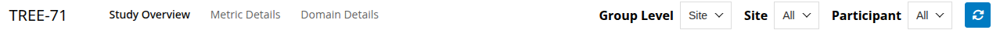](https://gilead-biostats.github.io/gsm.app/dev/articles/requirements/img/br-518/521-01-multilevel.png "multilevel")

multilevel

single level

If the “Group Level” filter is displayed, the user can filter the data
by group level.

choices country

choices site

The user can filter the data by group (e.g., “Site” or “Country”) within
the selected “Group Level”.

participants: group selected

participants: no group

The user can filter the data by “Participant”.

counts: no participant

counts: participant

The user can reset all filters to their default values.

before reset

522: Feature: The user can drill down into views of different aspects of
the data.

[GitHub issue](https://github.com/Gilead-BioStats/gsm.app/issues/522)

The user can navigate between the main sections of the app using a
navigation bar at the top of the page.

domain details

metric details

523: Feature: The user can view a card with a high-level overview of the
study metadata.

[GitHub issue](https://github.com/Gilead-BioStats/gsm.app/issues/523)

The card is the validated card generated by gsm.kri::Report_StudyInfo().

study info card

524: Feature: The user can view an interactive KRI summary table.

[GitHub issue](https://github.com/Gilead-BioStats/gsm.app/issues/524)

The table is the validated group overview generated by
[`gsm.kri::Widget_GroupOverview()`](https://gilead-biostats.github.io/gsm.kri/reference/Widget_GroupOverview.html).

kri summary table

The KRI summary table is filtered to the selected “Group Level”.

[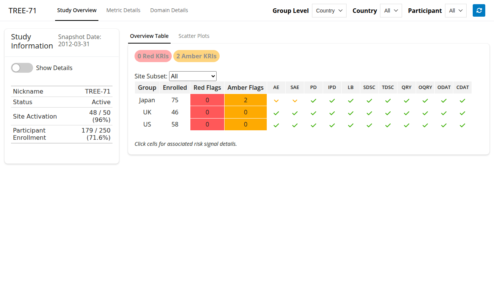](https://gilead-biostats.github.io/gsm.app/dev/articles/requirements/img/br-518/524-02-country.png "country")

country

[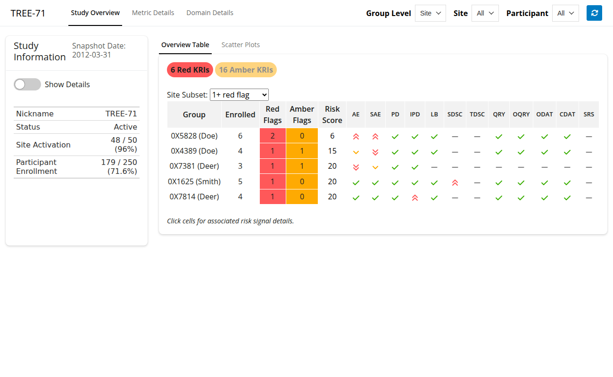](https://gilead-biostats.github.io/gsm.app/dev/articles/requirements/img/br-518/524-02-site.png "site")

site

The user can filter the KRI summary table by flag status (red, amber, or
both) using clickable pills.

[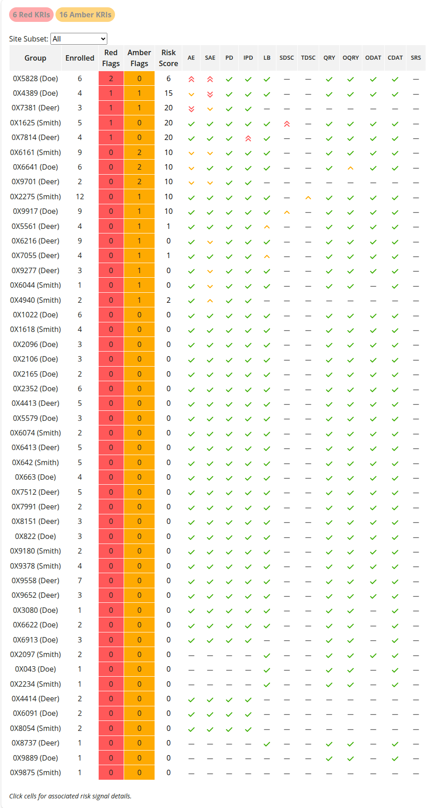](https://gilead-biostats.github.io/gsm.app/dev/articles/requirements/img/br-518/524-03-all.png "all")

all

amber only

red and amber

red only

The flag status pills display a count of KRIs with that flag status for
the selected “Group Level”.

country

site

Clicking a KRI cell in the summary table navigates the user to the
“Metric Details” tab, filtered to that KRI and group.

table click navigation

525: Feature: The user can view a set of interactive scatter plots, one
for each KRI.

[GitHub issue](https://github.com/Gilead-BioStats/gsm.app/issues/525)

The interactive scatter plots are based on
[`gsm.kri::Widget_ScatterPlot()`](https://gilead-biostats.github.io/gsm.kri/reference/Widget_ScatterPlot.html).

scatter plots

The set of scatter plots is filtered to show only plots relevant to the
selected “Group Level”.

[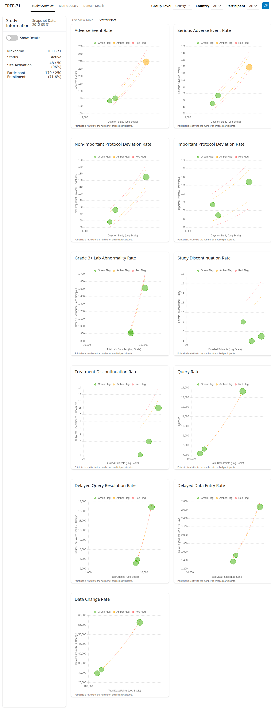](https://gilead-biostats.github.io/gsm.app/dev/articles/requirements/img/br-518/525-02-country.png "country")

country

[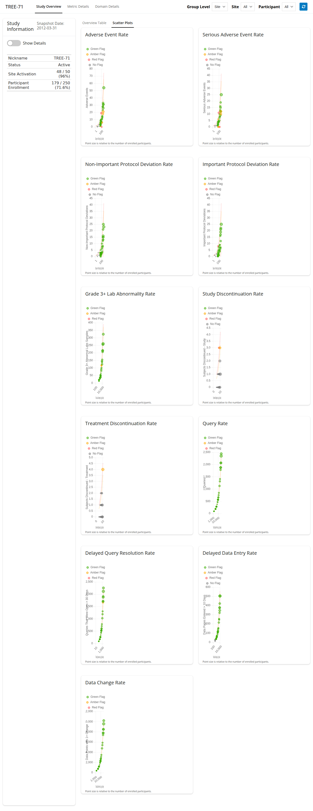](https://gilead-biostats.github.io/gsm.app/dev/articles/requirements/img/br-518/525-02-site.png "site")

site

Clicking a point in a scatter plot navigates the user to the “Metric
Details” tab, filtered to that KRI and group.

plot click navigation

526: Feature: The user can view visualizations of a single KRI.

[GitHub issue](https://github.com/Gilead-BioStats/gsm.app/issues/526)

The user can select the KRI via a dropdown menu.

default kri

changed kri

The KRI selection dropdown is filtered to show only KRIs relevant to the
selected “Group Level”.

country choices

site choices

The user can navigate to different visualizations of this KRI via tabs.

[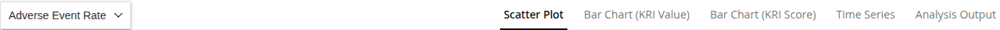](https://gilead-biostats.github.io/gsm.app/dev/articles/requirements/img/br-518/526-03-tabs.png "tabs")

tabs

527: Feature: The user can view an interactive scatter plot of the
selected KRI’s latest results.

[GitHub issue](https://github.com/Gilead-BioStats/gsm.app/issues/527)

The interactive scatter plot is based on
[`gsm.kri::Widget_ScatterPlot()`](https://gilead-biostats.github.io/gsm.kri/reference/Widget_ScatterPlot.html).

scatter plot

The selected group is highlighted in the interactive scatter plot.

scatter plot: selected

Clicking a group in the scatter plot updates the group drop-down.

scatter plot: click

528: Feature: The user can view an interactive bar chart of the selected
KRI’s latest metric values.

[GitHub issue](https://github.com/Gilead-BioStats/gsm.app/issues/528)

The interactive bar chart (value) is based on
[`gsm.kri::Widget_BarChart()`](https://gilead-biostats.github.io/gsm.kri/reference/Widget_BarChart.html).

bar chart: values

The selected group is highlighted in the interactive bar chart (value).

bar chart: values: selected

Clicking a group in the bar chart (value) updates the group drop-down.

bar chart: values: click

529: Feature: The user can view an interactive bar chart of the selected
KRI’s latest scores.

[GitHub issue](https://github.com/Gilead-BioStats/gsm.app/issues/529)

The interactive bar chart (score) is based on
[`gsm.kri::Widget_BarChart()`](https://gilead-biostats.github.io/gsm.kri/reference/Widget_BarChart.html).

bar chart: scores

The selected group is highlighted in the interactive bar chart (score).

bar chart: scores: selected

Clicking a group in the bar chart (score) updates the group drop-down.

bar chart: scores: click

530: Feature: The user can view an interactive time-series plot of the
selected KRI’s scores across all available data snapshots.

[GitHub issue](https://github.com/Gilead-BioStats/gsm.app/issues/530)

The interactive time-series plot is based on
[`gsm.kri::Widget_TimeSeries()`](https://gilead-biostats.github.io/gsm.kri/reference/Widget_TimeSeries.html).

time series

The selected group is highlighted in the interactive time-series plot.

time series: selected

Clicking a group in the time-series plot updates the group drop-down.

time series: click

531: Feature: The user can view a table of the KRI results for each
group.

[GitHub issue](https://github.com/Gilead-BioStats/gsm.app/issues/531)

The KRI results table is generated by
[`gsm.kri::Report_MetricTable()`](https://gilead-biostats.github.io/gsm.kri/reference/Report_MetricTable.html).

analysis output

The selected group is highlighted in the KRI results table.

analysis output: selected

Clicking a group in the KRI results table updates the group drop-down.

analysis output: click

532: Feature: When a group is selected, the user can view that group’s
metadata.

[GitHub issue](https://github.com/Gilead-BioStats/gsm.app/issues/532)

The group metadata contains all information about this Group from the
`dfGroups` input table.

group metadata

533: Feature: When a group is selected, the user can view a table of
participants within that group.

[GitHub issue](https://github.com/Gilead-BioStats/gsm.app/issues/533)

The participant table shows each participant’s numerator, denominator,
and metric values for the selected KRI.

participant table

Clicking a participant in the participant table selects that participant
and navigates to the Domain Details tab.

participant table: click

534: Feature: The user can view raw domain data.

[GitHub issue](https://github.com/Gilead-BioStats/gsm.app/issues/534)

The user can switch between different domain data views using a set of
tabs.

The user can view the raw data for the selected domain in a table.

The domain data table is filtered by the selected “Group” and
“Participant”.

The app displays an error message if it is unable to load data for a
specific domain.

535: Feature: The user can view a summary of the number of records for
each available data domain.

[GitHub issue](https://github.com/Gilead-BioStats/gsm.app/issues/535)

This feature has been superseded by one or more later features. See the
GitHub issue for details.

536: Feature: The user can view tabs provided by plugins.

[GitHub issue](https://github.com/Gilead-BioStats/gsm.app/issues/536)

If a single plugin is included in the app, it appears as a new tab.

[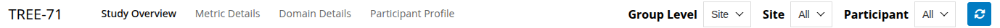](https://gilead-biostats.github.io/gsm.app/dev/articles/requirements/img/br-518/536-01-single.png "single")

single

If a plugin specifies required inputs, a placeholder is shown if that
input is set to “All”.

[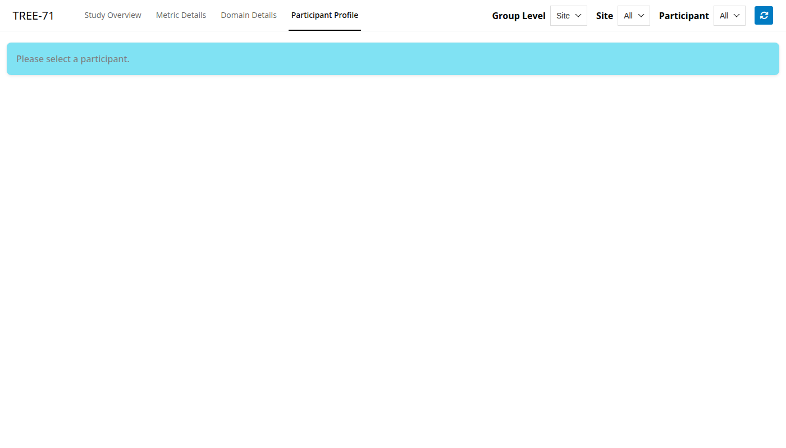](https://gilead-biostats.github.io/gsm.app/dev/articles/requirements/img/br-518/536-02-01-placeholder.png "placeholder")

placeholder

[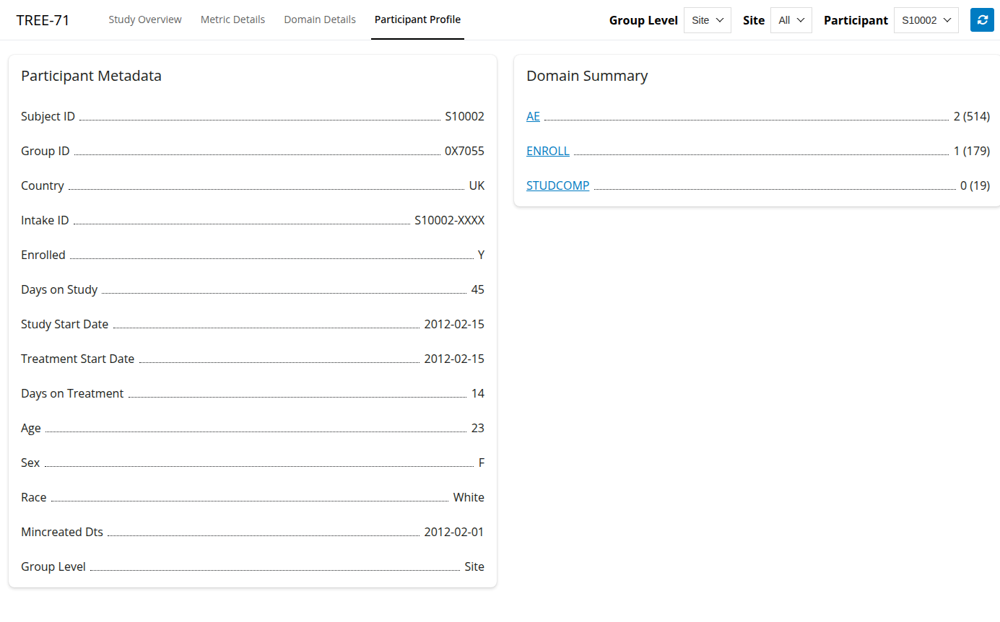](https://gilead-biostats.github.io/gsm.app/dev/articles/requirements/img/br-518/536-02-02-loaded.png "loaded")

loaded

If multiple plugins are provided, they are grouped under a “Plugins”
dropdown menu in the navigation bar.

[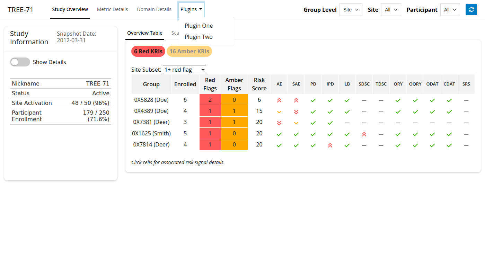](https://gilead-biostats.github.io/gsm.app/dev/articles/requirements/img/br-518/536-03-multiple.png "multiple")

multiple
