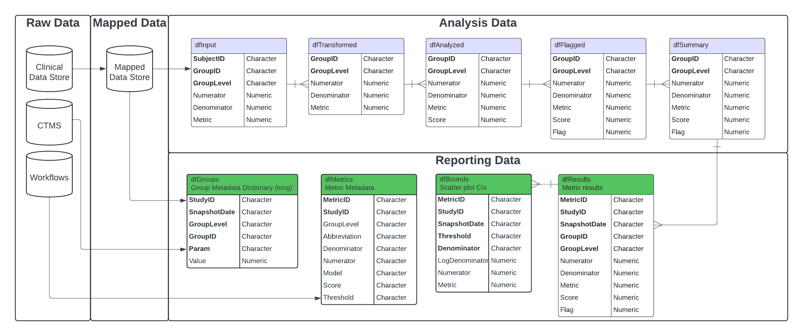

```{r, include = FALSE}
knitr::opts_chunk$set(
  collapse = TRUE,
  comment = "#>",
  eval = FALSE
)
```

```{r setup}
library(gsm.app)
library(dplyr)
library(purrr)
```

# Introduction

The {gsm.app} package creates interactive dashboards for exploring Good Statistical Monitoring (GSM) Key Risk Indicator (KRI) assessments in clinical trials. This vignette provides a comprehensive guide on how to prepare data for use with the {gsm.app} Shiny application and how to deploy an app.

The {gsm} suite of packages leverages Key Risk Indicators (KRIs) and thresholds to conduct study-level, country-level and site-level Risk Based Monitoring for clinical trials. {gsm.app} package tailored to the {gsm} analysis data model that connects risk signals with the underlying data

The image below illustrates the overarching context in which the reporting workflow runs, taking inputs from both the output of the analytics workflow, as well as raw study-, site-, and country-level data in the Raw/Raw+ format.

{width="100%"}

Preparing data for use with {gsm.app} involves a standardized, reproducible pipeline leveraging the {gsm.core}, {gsm.mapping}, {gsm.kri}, and {gsm.reporting} packages. The process consists of the following high-level steps:

1.  [Set Up Data Sources](https://gilead-biostats.github.io/gsm.core/articles/DataModel.html#raw-and-mapped-data).

    Define and load your raw clinical and operational data.

2.  [Create Mapping Workflows](https://gilead-biostats.github.io/gsm.core/articles/Cookbook.html#example-3---study-level-reporting-workflows)

    Specify and apply mapping workflows to transform raw data into standardized mapped data.

3.  [Generate Mapped Data Layer](https://gilead-biostats.github.io/gsm.core/articles/Cookbook.html#automate-data-ingestion-using-ingest-and-combinespecs)

    Use mapping specifications to ingest, filter, and join data, producing a harmonized mapped data layer.

4.  [Run Analysis Workflows](https://gilead-biostats.github.io/gsm.core/articles/DataAnalysis.html)

    Apply analysis workflows to calculate Key Risk Indicators (KRIs) and perform statistical modeling.

5.  [Create Reporting Data](https://gilead-biostats.github.io/gsm.reporting/articles/DataReporting.html#step-by-step-reporting-workflow)

    Transform analysis results into reporting-ready data frames for use in dashboards and reports. The reporting data model is documented in detail at [Reporting Data](https://gilead-biostats.github.io/gsm.core/articles/DataModel.html#reporting-data).

At this point, you should have all required data structures.

The {gsm.app} requires five main data frames to operate:

1.  **`dfAnalyticsInput`** - Participant-level metric data (stacked across metrics)
2.  **`dfBounds`** - Statistical bounds for flagging. Set of predicted percentages/rates and upper- and lower-bounds across the full range of sample sizes/total exposure values for reporting.
3.  **`dfGroups`** - Group-level metadata (sites, countries, study)
4.  **`dfMetrics`** - Metric-specific metadata for use in charts and reporting.
5.  **`dfResults`** - KRI assessment results. A stacked summary of analysis pipeline output.

# App Deployment

Now that our data are ready let's look at how to deploy an app.

## Creating the fnFetchData Function

The `fnFetchData` function is essential for the {gsm.app} to provide drill-down functionality for domain-specific data. This function tells the app how to fetch domain data and should return filtered data based on the parameters passed from the app interface.

```{r create-fnfetchdata, eval = FALSE}
fnFetchData <- function(strDomainID, strGroupLevel = NULL, strGroupID = NULL, 
                       strSubjectID = NULL, dSnapshotDate = NULL) {
  
  # Use the sample function as a template
  # In your implementation, replace this with code that fetches from your data sources
  gsm.app::sample_fnFetchData(
    strDomainID = strDomainID,
    strGroupLevel = strGroupLevel, 
    strGroupID = strGroupID,
    strSubjectID = strSubjectID,
    dSnapshotDate = dSnapshotDate
  )
}
```

## Running the App

Once you have prepared all the required data structures and the `fnFetchData` function, you can deploy the {gsm.app}.

For development and testing, run the app locally: run_gsm_app() creates a Shiny app to explore a set of clinical trial data. The app facilitates exploration of the data by allowing the user to click to dive deeper into aspects of the data.

```{r local-deployment, eval = FALSE}
# Create the app data structure
run_gsm_app(
  dfAnalyticsInput = dfAnalyticsInput,
  dfBounds = dfBounds,
  dfGroups = dfGroups,
  dfMetrics = dfMetrics,
  dfResults = dfResults,
  fnFetchData = fnFetchData,
  fnCountData = ConstructDataCounter(fnFetchData),
  chrDomains = c(AE = "Adverse Events", DATACHG = "Data Changes", DATAENT = "Data Entry",
    ENROLL = "Enrollment", LB = "Lab", PD = "Protocol Deviations", QUERY = "Queries",
    STUDCOMP = "Study Completion", SUBJ = "Subject Metadata", SDRGCOMP =
    "Treatment Completion"),
  lPlugins = NULL,
  strTitle = ExtractAppTitle(dfGroups),
  strFavicon = "angles-up",
  strFaviconColor = "#FF5859",
  tagListExtra = NULL,
  fnServer = NULL
)
```

# 
